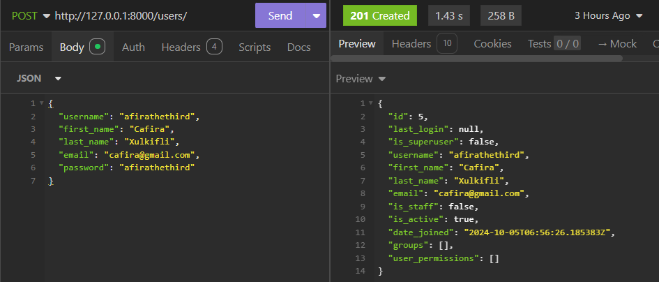
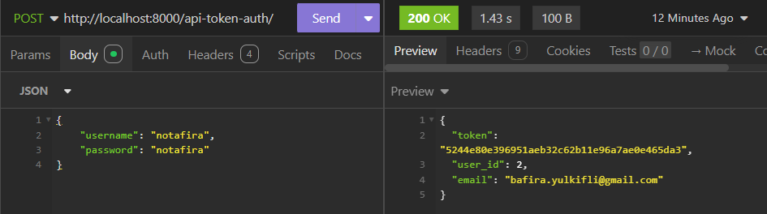
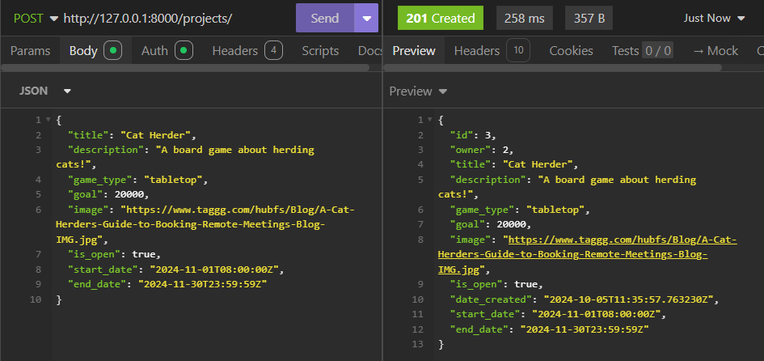
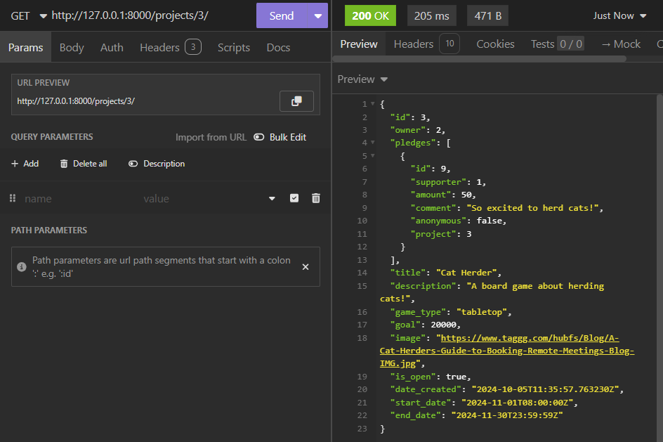
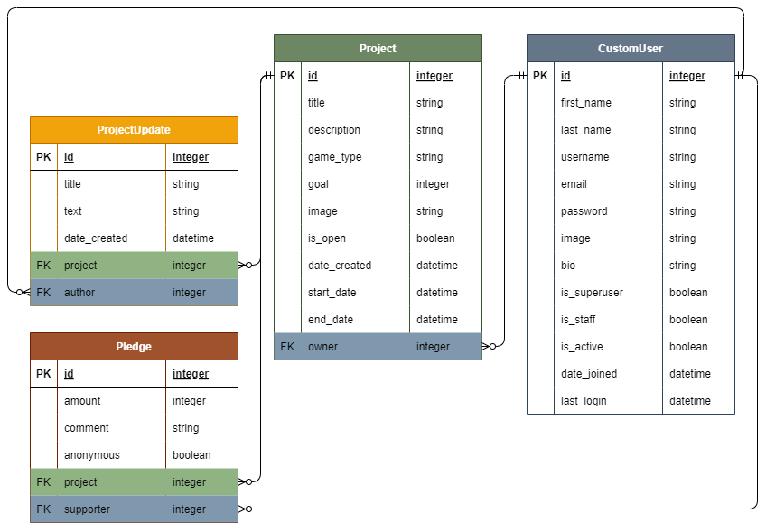

# :arrow_up: Level Launch :rocket:
Crowdfunding back end created by :star: Afira Zulkifli :star:

## About
Level Launch is a crowdfunding website with the aim of connecting people who make games with people who love to play games.

### Intended Audience/User Stories
- **Game designers, developers, and publishers** can use this platform to raise funds directly from their players to launch new games, downloadable content (DLC) or expansion packs for existing games.
- **Gamers** can use this platform to fund new games that pique their interest or to support existing games that they love by funding DLCs or expansions.

### Front End Pages/Functionality
- Home Page / Index
    - Login or create a new user account.
    - View a selection of featured projects, recently opened projects, or recently funded projects.
    - No login required to view this page.
- All Projects Page
    - View all open projects that are currently accepting pledges (no login required).
    - Create a new project (must be logged in).
- Project Detail Page
    - View one project's details.
    - View all pledges that have been made to the project.
    - No login required to view this page.
    - Update project details (must be logged in as the project owner).
    - Delete the project (must be logged in as the project owner).
    - Create a pledge to the project (must be logged in and not the project owner).
- User Profile Page
    - View one user's profile details (no login required).
    - Update user details (must be logged in as the user).
    - Delete the user account (must be logged in as the user).

## Back End Demonstration
### User Creation
Steps to create a new user on Insomnia:

1. Create a new HTTP request.
2. Change the request method to `POST`.
3. Input the following URL (API endpoint): http://127.0.0.1:8000/users/
4. In the Body tab, select JSON from the dropdown and fill in the fields in the following request body:
```
{
  "username": "{enter your username}",
  "first_name": "{enter your first name}",
  "last_name": "{enter your last name}",
  "email": "{enter your email}",
  "password": "{enter your password}"
}
```
5. Click the Send button. If the request was successful, it will return a `201 Created` status code.



To retrieve the authetication token for a user account, follow the steps above and create a new `POST` HTTP request with the username and password in the request body to the following URL: http://localhost:8000/api-token-auth/



### Project Creation
Steps to create a new project on Insomnia:

1. Create a new HTTP request.
2. Change the request method to `POST`.
3. Input the following URL (API endpoint): http://127.0.0.1:8000/projects/
4. In the Body tab, select JSON from the dropdown and fill in the fields in the following request body:
```
{
  "title": "{enter your project title}",
  "description": "{enter your project description}",
  "game_type": "{enter your game type}",
  "goal": {enter your project goal},
  "image": "{enter your project image URL}",
  "is_open": {true OR false},
  "start_date": "{enter your project start date}",
  "end_date": "{enter your project start date}"
}
```
5. Click the Send button. If the request was successful, it will return a `201 Created` status code.



To retrieve the details of the project, create a new `GET` HTTP request to the following URL using the project's ID number: http://127.0.0.1:8000/projects/(project_id)/



## Technical 
### API Specification
| HTTP Method | URL                      | Purpose                                                 | Request Body              | Successful Response Code | Authentication/Authorisation                              |
|-------------|--------------------------|---------------------------------------------------------|---------------------------|--------------------------|-----------------------------------------------------------|
| GET         | :green_book:/projects/   | Returns all projects                                    | N/A                       | 200 OK                   | N/A                                                       |
| POST        | :green_book:/projects/   | Create a new project                                    | [Project object](#project-creation)            | 201 Created              | Must be logged in                                         |
| GET         | :green_book:/projects/1/ | Returns the project with ID of “1”                      | N/A                       | 200 OK                   | N/A                                                       |
| PUT         | :green_book:/projects/1/ | Updates project with ID of “1”                          | [Project object](#project-creation)            | 200 OK                   | Must be logged in<br>Must be the project owner            |
| DELETE      | :green_book:/projects/1/ | Deletes the project with ID of “1”                      | N/A                       | 204 No Content           | Must be logged in<br>Must be the project owner            |
| GET         | :orange_book:/pledges/   | Returns all pledges                                     | N/A                       | 200 OK                   | N/A                                                       |
| POST        | :orange_book:/pledges/   | Create a new pledge                                     | Pledge object (see below) | 201 Created              | Must be logged in<br>Must not be the owner of the project |
| GET         | :orange_book:/pledges/1/ | Get the pledge with ID of “1”                           | N/A                       | 200 OK                   | N/A                                                       |
| PUT         | :orange_book:/pledges/1/ | Updates pledge with ID of “1”                           | Pledge object (see below) | 200 OK                   | Must be logged in<br>Must be the pledge supporter         |
| DELETE      | :orange_book:/pledges/1/ | Deletes the pledge with ID of “1”                       | N/A                       | 204 No Content           | Must be logged in<br>Must be the pledge supporter         |
| GET         | :blue_book:/users/       | Returns all users                                       | N/A                       | 200 OK                   | Must be logged in as a superuser                          |
| POST        | :blue_book:/users/       | Create a new user                                       | [User object](#user-creation)               | 201 Created              | N/A                                                       |
| GET         | :blue_book:/users/1/     | Returns the user with ID of “1”                         | N/A                       | 200 OK                   | N/A                                                       |
| PUT         | :blue_book:/users/1/     | Updates user with ID of “1”                             | [User object](#user-creation)               | 200 OK                   | Must be logged in as user with ID of “1”                  |
| DELETE      | :blue_book:/users/1/     | Deletes the user with ID of “1”                         | N/A                       | 204 No Content           | Must be logged in as user with ID of “1”                  |
| POST        | /api-token-auth/         | Returns a token for a given valid username and password | [User object](#user-creation)               | 200 OK                   | N/A                                                       |

Pledge request body:
```
{
  "amount": {enter amount pledged},
  "comment": "{enter pledge comment}",
  "anonymous": {true OR false},
  "project": {enter project ID}
}
```

### Database Schema
**Note:** The `ProjectUpdate` model and associated views, URLs and serializers have not been implemented yet, however its implementation would be similar to that of the `Pledge` model.



### Future Developments
- [ ] Add the ability for project owners to publish update blog posts for their project (`ProjectUpdate` model).
- [ ] Add new superuser permissions allow a superuser to update and delete any project, pledge, or user.
- [ ] Paginated responses to project and pledge `GET` requests.

## Requirements
### Project Requirements
This crowdfunding project must:

- [x] Be separated into two distinct projects: an API built using the Django Rest Framework and a website built using React. *(AZ Note: Coming soon on the React front end!)*
- [x] Have a cool name, bonus points if it includes a pun and/or missing vowels.
- [x] Have a clear target audience.
- [x] Have user accounts. A user should have at least the following attributes:
  - [x] Username
  - [x] Email address
  - [x] Password
- [x] Ability to create a “project” to be crowdfunded which will include at least the following attributes:
  - [x] Title
  - [x] Owner (a user)
  - [x] Description
  - [x] Image
  - [x] Target amount to fundraise
  - [x] Whether it is currently open to accepting new supporters or not
  - [x] When the project was created
- [x] Ability to “pledge” to a project. A pledge should include at least the following attributes:
  - [x] An amount
  - [x] The project the pledge is for
  - [x] The supporter/user (i.e. who created the pledge)
  - [x] Whether the pledge is anonymous or not
  - [x] A comment to go along with the pledge
- [x] Implement suitable update/delete functionality, e.g. should a project owner be allowed to update a project description?
- [x] Implement suitable permissions, e.g. who is allowed to delete a pledge?
- [x] Return the relevant status codes for both successful and unsuccessful requests to the API.
- [ ] Handle failed requests gracefully (e.g. you should have a custom 404 page rather than the default error page). *(AZ Note: Coming soon on the React front end!)*
- [x] Use Token Authentication, including an endpoint to obtain a token along with the current user's details.
- [ ] Implement responsive design. *(AZ Note: Coming soon on the React front end!)*

### Submission Requirements
The following should be included in this readme doc:

- [ ] A link to the deployed project. *(AZ Note: Incomplete because I'm submitting this assignment 3 weeks early - watch this space!)*
- [x] A screenshot of Insomnia, demonstrating a successful GET method for any endpoint.
- [x] A screenshot of Insomnia, demonstrating a successful POST method for any endpoint.
- [x] A screenshot of Insomnia, demonstrating a token being returned.
- [x] Step by step instructions for how to register a new user and create a new project (i.e. endpoints and body data).
- [x] Your refined API specification and Database Schema.